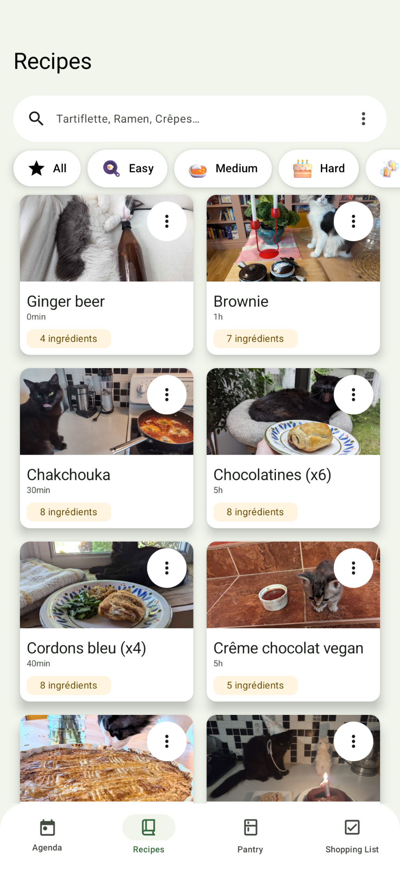

# PlanEat

## Goal

PlanEat is a meal planner. The goal is to store recipes from various sources (websites or local) and add it to an agenda to generate a shopping list.

## Build instructions

Import the project with Android Studio.

The rest should be automatic. But if you want to regenerate AI models to classify ingredients, it will add some steps:

## Generate AI models

### Parsing ingredients

Please refer to [this page](models/ingredients_parser/README.md)

### Categorize ingredients

To categorize ingredients, a default database is populated with custom ingredients.
If the ingredient is not in this database, it will be added by retrieving the aisle by parsing metro.ca

### Classify recipes

Please refer to [this page](models/tag_classifier/README.md)

## Structure

Please, feel free to contribute to this project in submitting patches, corrections, opening issues, etc.

For more infos and ideas read [CONTRIBUTING.md](/CONTRIBUTING.md) and [CODE_OF_CONDUCT.md](/CODE_OF_CONDUCT.md).

You can also add you own instance to instances.txt to connect to other instances!